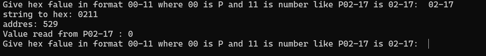
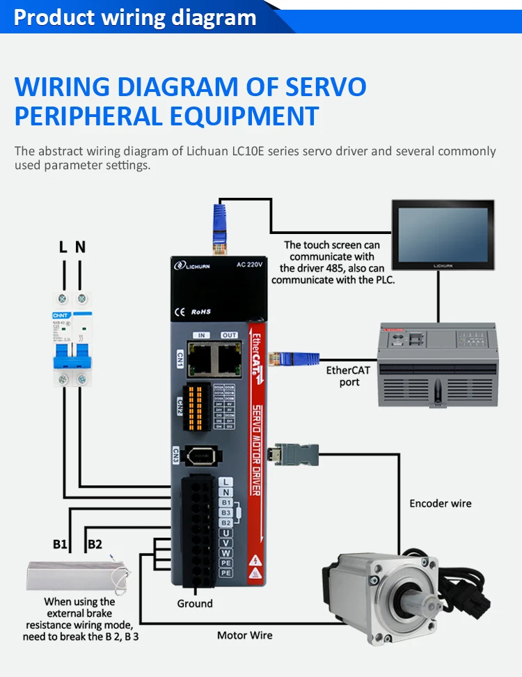
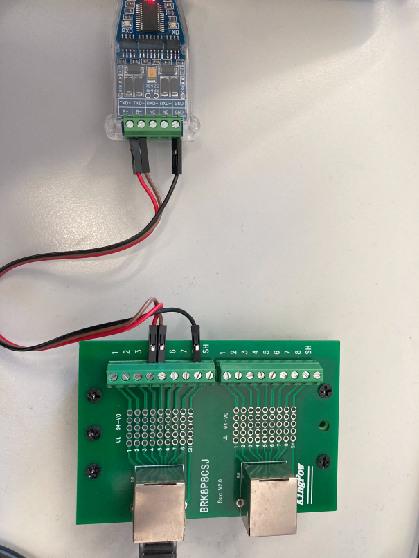

# lichuan_servo_modbus
## Python script usefull for check any lichuan LC10E-200W servo drive parameter 
## Based on Tesla900/LichuanServoTest . Thanks for Your's work Tesla900.
### Tested with :
* Lichuan LC10E-200W 
* USB_TO_RS485 CONVERTER https://www.gotronik.pl/usb-rs485rs422-konwerter-na-ft232rl-p-8188.html
### Program usage example

### Hardware example ( this script works as a HMI in this diagram)

### Wiring RJ-45 MODBUS to RS-485 converter 
